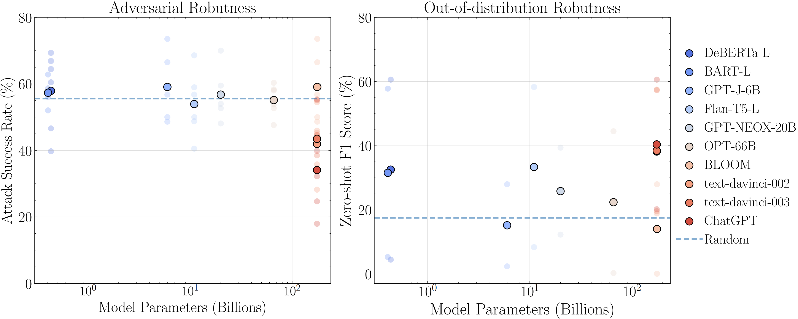

# Robustness evaluation of ChatGPT

This repo contains the source code in the paper [On the Robustness of ChatGPT: An Adversarial and Out-of-distribution Perspective](https://arxiv.org/abs/2302.12095).



This project is to evaluate the robustness of ChatGPT as well as some foundation language models.
You can find the results [here](#results).

## Pre-requisites

First, clone and get into the repo:
```
git clone https://github.com/microsoft/robustlearn.git
cd robustlearn/chatgpt-robust
```

Then, install the following important depencencies by:
- `pip install transformers pandas nltk jieba`
- Note that this code repo does **NOT** provide usage of ChatGPT. Optionally, you can use it from its official website (https://chat.openai.com/chat) or use the third-party library to imititate the brower activity (https://github.com/mmabrouk/chatgpt-wrapper).

You can also create an conda virtual environment by running `conda env create -f environment.yml`.

## Usage

All things can be used by running `main.py`:

For classification tasks:
- Use Huggingface: `python main.py --dataset advglue --task sst2 --service hug --model xxx`
- Use GPT API: `python main.py --dataset advglue --task sst2 --service gpt --model text-davinci-003`

For translation tasks:
- Use Huggingface: `python main.py --dataset advglue-t --task translation_en_to_zh --service hug --model xx`


## Results

Note that you will not get the final results by simply running the codes, since the outputs of generative models are not stable. We need some manual process. Bad cases of AdvGLUE and Flipkart are pvovided in [this folder](./result/chatgpt_results/).

Here is the summary of the results. Additionally, we also provide all the bad cases of ChatGPT in [`result/chatgpt_results`](./result/chatgpt_results/) folder. Please note that results of all ChatGPT and other LLMs are manually processed by humans.

### Adversarial robustness for classification.

The metric is attack success rate (ASR).

| Model                    | SST-2     | QQP       | MNLI      | QNLI      | RTE       | ANLI      |
|--------------------------|-----------|-----------|-----------|-----------|-----------|-----------|
| Random                   | 50.0      | 50.0      | 66.7      | 50.0      | 50.0      | 66.7      |
| DeBERTa-L (435 M)        | 66.9      | 39.7      | 64.5      | 46.6      | 60.5      | 69.3      |
| BART-L (407 M)           | 56.1      | 62.8      | 58.7      | 52.0      | 56.8      | 57.7      |
| GPT-J                    | 48.7      | 59.0      | 73.6      | 50.0      | 56.8      | 66.5      |
| T5 (11 B)                | 40.5      | 59.0      | 48.8      | 49.7      | 56.8      | 68.6      |
| T0 (11 B)                | **36.5** | 60.3      | 72.7      | 49.7      | 56.8      | 77.2      |
| NEOX-20B                 | 52.7      | 56.4      | 59.5      | 54.0      | 48.1      | 70.0      |
| OPT (66 B)               | 47.6      | 53.9      | 60.3      | 52.7      | 58.0      | 58.3      |
| BLOOM (176 B)            | 48.7      | 59.0      | 73.6      | 49.7      | 56.8      | 66.5      |
| text-davinci-002 (175 B) | 46.0      | 28.2      | 54.6      | 45.3      | 35.8      | 68.8      |
| text-davinci-003 (175 B) | 44.6      | 55.1      | 44.6      | 38.5      | 34.6      | 62.9      |
| ChatGPT (175 B)          | 39.9      | **18.0** | **32.2** | **34.5** | **24.7** | **55.3** |


### Adversarial robustness for machine translation

The metrics are BLEU, GLEU, and METEOR.

| Translation                 | BLEU     | GLEU      | METEOR    |
|-----------------------------|----------|-----------|-----------|
| Helsinki-NLP/opus-mt-en-zh  | 18.11    | 26.78     | 46.38     |
| liam168/trans-opus-mt-en-zh | 15.23    | 24.89     | 45.02     |
| text-davinci-002            | 24.97    | 36.3      | 59.28     |
| text-davinci-003            | **30.6** | **40.01** | **61.88** |
| ChatGPT                     | 26.27    | 37.29     | 58.95     |

### Out-of-distribution robustness

The metric is F1 score.

| Model                    | Flipkart | DDXPlus |
|--------------------------|----------|---------|
| Random                   | 20       | 4       |
| DeBERTa-L (435 M)        | 60.6     | 4.5     |
| BART-L (407 M)           | 57.8     | 5.3     |
| GPT-J                    | 28       | 2.4     |
| T5 (11 B)                | 58.8     | 6.3     |
| T0 (11 B)                | 58.3     | 8.4     |
| NEOX-20B                 | 39.4     | 12.3    |
| OPT (66 B)               | 44.5     | 0.3     |
| BLOOM (176 B)            | 28       | 0.1     |
| text-davinci-002 (175 B) | 57.5     | 18.9    |
| text-davinci-003 (175 B) | 57.3     | 19.6    |
| ChatGPT (175 B)          | 60.6     | 20.2    |

## Citation

To do.