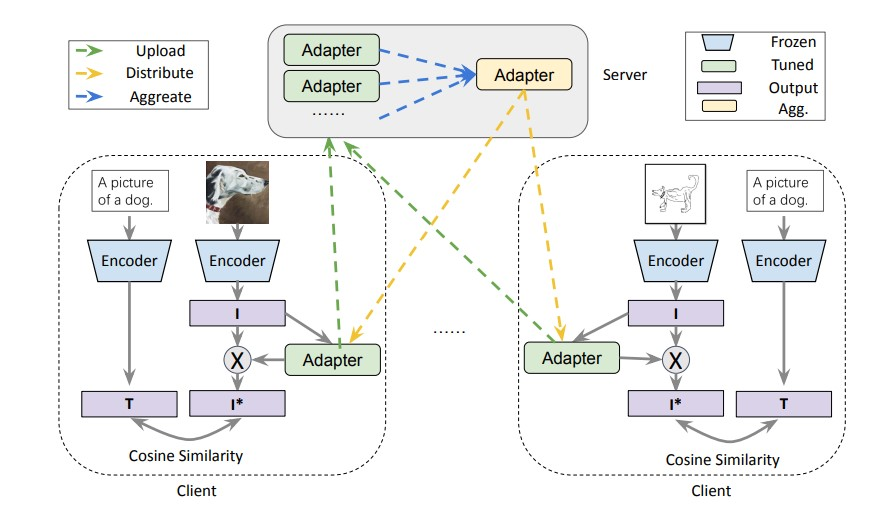

# FedCLIP: Fast Generalization and Personalization for CLIP in Federated Learning

This project implements our paper [FedCLIP: Fast Generalization and Personalization for CLIP in Federated Learning](https://arxiv.org/abs/2302.13485v1). Please refer to our paper [1] for the method and technical details. 



**Abstract:** Federated learning (FL) has emerged as a new paradigm for privacy-preserving computation in recent years. Unfortunately, FL faces two critical challenges that hinder its actual performance: data distribution heterogeneity and high resource costs brought by large foundation models. Specifically, the non-IID data in different clients make existing FL algorithms hard to converge while the high resource costs, including computational and communication costs that increase the deployment difficulty in real-world scenarios. In this paper, we propose an effective yet simple method, named FedCLIP, to achieve fast generalization and personalization for CLIP in federated learning. Concretely, we design an attention-based adapter for the large model, CLIP, and the rest operations merely depend on adapters. Lightweight adapters can make the most use of pretrained model information and ensure models be adaptive for clients in specific tasks. Simultaneously, small-scale operations can mitigate the computational burden and communication burden caused by large models. Extensive experiments are conducted on three datasets with distribution shifts. Qualitative and quantitative results demonstrate that FedCLIP significantly outperforms other baselines (9% overall improvements on PACS) and effectively reduces computational and communication costs (283x faster than FedAVG). 


## Requirement

The required packages are listed in `requirements.txt` for minimum requirement (Python 3.8.5):

```
pip install -r requirements.txt
```

## Dataset 
PACS can be downloaded from [
PACS](https://wjdcloud.blob.core.windows.net/dataset/PACS.zip).
PACS is a popular object classification benchmark. It is composed of four sub-datasets, including photo, art-painting, cartoon, and sketch. There exist 9, 991 images in total and the dataset contains 7 classes, including dog, elephant, giraffe, guitar, horse, house, and person. Large discrepancies in image styles widely exist among different sub-datasets. In this project, we view each sub-dataset as a client. We choose three subdatasets as participated clients while the rest served as the target client to evaluate generalization ability. For each participated client, we split the corresponding sub-dataset into three parts, 60% for training, 20% for validation, and the rest 20% for testing. Validation parts of data are used for model selection.

```
wget https://wjdcloud.blob.core.windows.net/dataset/PACS.zip
unzip PACS.zip
```

## How to run

We provide the commands for four tasks in PACS to reproduce the results.

```
python methods/fed_at_clip.py --dataset pacs --mode FedAtImg --test_envs 0 --iters 200 --wk_iters 1 --lr 5e-05
```

```
python methods/fed_at_clip.py --dataset pacs --mode FedAtImg --test_envs 1 --iters 200 --wk_iters 1 --lr 5e-05
```

```
python methods/fed_at_clip.py --dataset pacs --mode FedAtImg --test_envs 2 --iters 200 --wk_iters 1 --lr 5e-05
```

```
python methods/fed_at_clip.py --dataset pacs --mode FedAtImg --test_envs 3 --iters 200 --wk_iters 1 --lr 5e-05
```

## Results

**PACS**

| Backbone | AlexNet |         |  CLIP  |         |           |
|----------|:-------:|:-------:|:------:|:-------:|:---------:|
| Methods  | FedAVG  | FedProx | FedAVG | FedProx | Ours      |
| A        | 60.93   | 59.89   | 64.65  | 77.81   | **95.15** |
| C        | 57.99   | 58.88   | 84.5   | 87.95   | **95.36** |
| P        | 59.68   | 59.41   | 87.87  | 89.42   | **95.46** |
| S        | 56.14   | 55.89   | 89.16  | 90.08   | **94.99** |
| AVG      | 58.69   | 58.52   | 81.55  | 86.32   | **95.24** |

## Contact

- luwang@ict.ac.cn
- jindongwang@outlook.com


## References

```
@article{lu2023fedclip,
  title={FedCLIP: Fast Generalization and Personalization for CLIP in Federated Learning},
  author={Lu, Wang and Hu, Xixu and Wang, Jindong and Xie, Xing},
  journal={IEEE Data Engineering Bulletin},
  year={2023}
}
```
