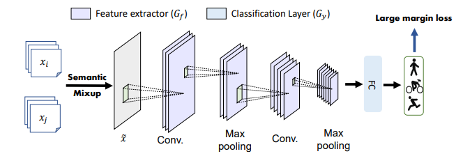

# Semantic-Discriminative Mixup for Generalizable Sensor-based Cross-domain Activity Recognition

This project implements our paper [Semantic-Discriminative Mixup for Generalizable Sensor-based Cross-domain Activity Recognition](http://arxiv.org/abs/2206.06629). Please refer to our paper [1] for the method and technical details. 



**Abstract:** It is expensive and time-consuming to collect sufficient labeled data to build human activity recognition (HAR) models. Training on existing data often makes the model biased towards the distribution of the training data, thus the model might perform terribly on test data with different distributions. Although existing efforts on transfer learning and domain adaptation try to solve the above problem, they still need access to unlabeled data on the target domain, which may not be possible in real scenarios. Few works pay attention to training a model that can generalize well to unseen target domains for HAR. In this paper, we propose a novel method called Semantic-Discriminative Mixup (SDMix) for generalizable cross-domain HAR. Firstly, we introduce semantic-aware Mixup that considers the activity semantic ranges to overcome the semantic inconsistency brought by domain differences. Secondly, we introduce the large margin loss to enhance the discrimination of Mixup to prevent misclassification brought by noisy virtual labels. Comprehensive generalization experiments on five public datasets demonstrate that our SDMix substantially outperforms the state-of-the-art approaches with 6% average accuracy improvement on cross-person, cross-dataset, and cross-position HAR.


## Requirement

The required packages are listed in `requirements.txt` for minimum requirement (Python 3.8.5):

```
$ pip install -r requirements.txt
$ pip install torch==1.10.1+cu111 torchvision==0.11.2+cu111 torchaudio==0.10.1 -f https://download.pytorch.org/whl/cu111/torch_stable.html
```

## Dataset 
UCI daily and sports dataset (DSADS) consists of 19 activities collected from 8 subjects wearing body-worn sensors on 5 body parts. 19 activities include sitting, standing, lying on back and on right side, ascending and descending stairs, standing in an elevator still, moving around in an elevator, walking in a parking lot, walking on a treadmill with a speed of 4 km/h, running on a treadmill with a speed of 8 km/h, exercising on a stepper, exercising on a cross trainer, cycling on an exercise bike in horizontal and vertical positions, rowing, jumping, and playing basketball. Each subject wears three sensors: accelerometer, gyroscope, and magnetometer

```
wget https://wjdcloud.blob.core.windows.net/dataset/lwdata/act/dsads/dsads/dsads_x.npy
wget https://wjdcloud.blob.core.windows.net/dataset/lwdata/act/dsads/dsads/dsads_y.npy
```

## How to run

We provide the commands for four tasks in DSADS to reproduce the results.

```
python train.py --N_WORKERS 1 --data_dir ../data/act/ --task cross_people --test_envs 0 --dataset dsads --algorithm SDMix --mixupregtype ld-margin --mixupalpha 0.1 --normstyle max --disttype 2-norm --mixup_ld_margin 100 --top_k 2 --output ./results/0
```

```
python train.py --N_WORKERS 1 --data_dir ../data/act/ --task cross_people --test_envs 1 --dataset dsads --algorithm SDMix --mixupregtype ld-margin --mixupalpha 0.2 --normstyle max --disttype 1-norm --mixup_ld_margin 10000 --top_k 5 --output ./results/1
```

```
python train.py --N_WORKERS 1 --data_dir ../data/act/ --task cross_people --test_envs 2 --dataset dsads --algorithm SDMix --mixupregtype ld-margin --mixupalpha 0.5 --normstyle max --disttype 2-norm --mixup_ld_margin 10 --top_k 5 --output ./results/2
```

```
python train.py --N_WORKERS 1 --data_dir ../data/act/ --task cross_people --test_envs 3 --dataset dsads --algorithm SDMix --mixupregtype ld-margin --mixupalpha 1 --normstyle avg --disttype cos --mixup_ld_margin 100000 --top_k 5 --output ./results/3
```

## Results

**PACS**

| Source   | 1,2,3      | 0,2,3      | 0,1,3      | 0,1,2      | AVG        |
|----------|------------|------------|------------|------------|------------|
| Target   | 0          | 1          | 2          | 3          | -          |
| DeepAll  | 83.26      | 77.79      | 84.68      | 74.74      | 80.12      |
| DANN     | 88.09      | 79.37      | 82.48      | 76.05      | 81.50      |
| CORAL    | 90.51      | 83.58      | 83.04      | 75.45      | 83.15      |
| ANDMask  | 85.17      | 77.73      | 83.32      | 78.17      | 81.10      |
| GroupDRO | 91.77      | 84.30      | 82.06      | 78.48      | 84.15      |
| RSC      | 84.21      | 78.79      | 81.48      | 77.12      | 80.40      |
| Mixup    | 88.08      | 80.95      | 88.00      | 84.20      | 85.31      |
| GILE     | 79.67      | 75.00      | 77.00      | 67.00      | 74.65      |
| SDMix    | **95.48 ** | **92.72 ** | **94.34 ** | **90.57 ** | **93.28 ** |

## Contact

- luwang@ict.ac.cn
- jindongwang@outlook.com


## References

```
@article{lu2022semantic,
  title={Semantic-discriminative mixup for generalizable sensor-based cross-domain activity recognition},
  author={Lu, Wang and Wang, Jindong and Chen, Yiqiang and Pan, Sinno Jialin and Hu, Chunyu and Qin, Xin},
  journal={Proceedings of the ACM on Interactive, Mobile, Wearable and Ubiquitous Technologies},
  volume={6},
  number={2},
  pages={1--19},
  year={2022},
  publisher={ACM New York, NY, USA}
}
```
